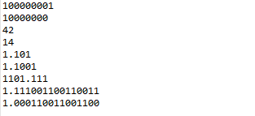
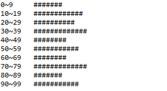
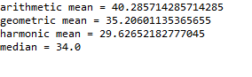
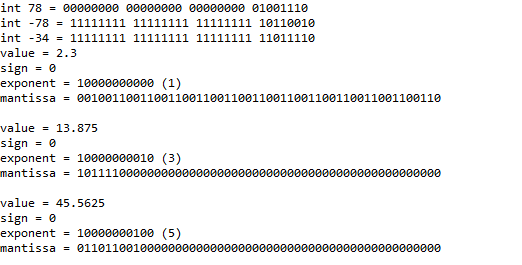
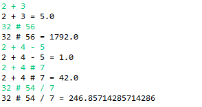
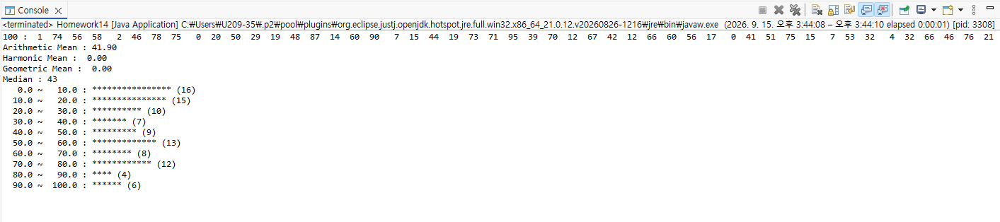
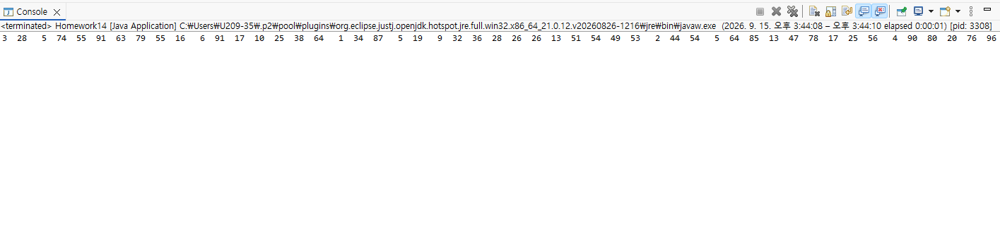

# OOP2026
# Homework 전체정리


### Homework 0
```java
public class Homework1{
  public static void main(String []args){
    int i, j;
    for(i=0; i<10; i++) {
      for(j=0; j<10; j++) {
        System.out.print("#");
      }
      System.out.println("");
    }
  }
}

```


### Homework1

```java

public class Homework1 {
	
    public static void main(String[] args) {
        int i, j;

        System.out.println();
        for (i = 1; i <= 10; i++) {
            for (j = 1; j <= i; j++) {
                System.out.print("#");
            }
            System.out.println("");
        }

        System.out.println();
        for (i = 1; i <= 10; i++) {
            for (j = 10; j > i; j--) {
                System.out.print(" ");
            }
            for (j = 1; j <= i; j++) {
                System.out.print("#");
            }
            System.out.println("");
        }

        System.out.println();
        for (i = 10; i >= 1; i--) {
            for (j = 1; j <= i; j++) {
                System.out.print("#");
            }
            System.out.println("");
        }

        System.out.println();
        for (i = 10; i >= 1; i--) {
            for (j = 10; j > i; j--) {
                System.out.print(" ");
            }
            for (j = 1; j <= i; j++) {
                System.out.print("#");
            }
            System.out.println("");
        }
    }
}
```
### Homework1결과화면 


### Homework2
```java

package homework;

public class Homework2 {
    public static void main(String[] args) {
        int n = 20;
        long[] fib = new long[n];
        fib[0] = 1;
        fib[1] = 1;

        for (int i = 2; i < n; i++) {
            fib[i] = fib[i - 1] + fib[i - 2];
        }

        for (int i = 0; i < n; i++) {
            System.out.print(fib[i] + " ");
        }
        System.out.println();
    }
}

```

### Homework2결과화면


### Homework3
```java
package homework;

public class Homework3 {
    public static void main(String[] args) {
        int n = 20;
        long[] fib = new long[n];
        fib[0] = 1;
        fib[1] = 1;

        for (int i = 2; i < n; i++) {
            fib[i] = fib[i - 1] + fib[i - 2];
        }

        for (int i = 1; i < n; i++) {
            double ratio = (double) fib[i] / fib[i - 1];
            System.out.println(fib[i] + "/" + fib[i - 1] + "=" + ratio);
        }
    }
}
```

### Homework3결과화면


### Homework4
``` java
package homework;

public class Homework4 {
    public static void main(String[] args) {
        for (int dan = 1; dan <= 9; dan++) {
            for (int i = 1; i <= 9; i++) {
                System.out.print(i + "*" + dan + "=" + (i * dan) + " ");
            }
            System.out.println();
        }
    }
}
```

### Homework4결과화면


### Homework5
```java
package homework;

public class Homework5 {
    public static void main(String[] args) {
        // Gregory-Leibniz series: 4/1 - 4/3 + 4/5 - 4/7 + ...
        double gregory = 0;
        int terms = 100000; 
        for (int k = 0; k < terms; k++) {
            double term = 4.0 / (2 * k + 1);
            if (k % 2 == 0) {
                gregory += term;
            } else {
                gregory -= term;
            }
        }
        System.out.println("Gregory-Leibniz 근사값: " + gregory);

        // Madhava series: sqrt(12) * sum( (-1/3)^k / (2k+1) )
        double madhava = 0;
        for (int k = 0; k < 20; k++) { 
            double term = Math.pow(-1.0 / 3.0, k) / (2 * k + 1);
            madhava += term;
        }
        madhava *= Math.sqrt(12);
        System.out.println("Madhava 근사값: " + madhava);

        System.out.println("실제 파이 값: " + Math.PI);
    }
}
```

### Homework5결과화면


### Homework6
```java
package homework;

public class Homework6 {
    public static void main(String[] args) {
        int n = 6; //
        int[][] binomial = new int[n][n];

        for (int i = 0; i < n; i++) {
            for (int j = 0; j <= i; j++) {
                if (j == 0 || j == i) {
                    binomial[i][j] = 1;
                } else {
                    binomial[i][j] = binomial[i - 1][j - 1] + binomial[i - 1][j];
                }
            }
        }

        for (int i = 0; i < n; i++) {
            for (int j = 0; j <= i; j++) {
                System.out.print(binomial[i][j] + " ");
            }
            System.out.println();
        }
    }
}
```

### Homework6결과화면


### Homework7
```java
package homework;

public class Homework7 {
    public static void main(String[] args) {
        int[] data = new int[20];

        // 랜덤 값 채우기
        for (int i = 0; i < 20; i++) {
            data[i] = (int) (Math.random() * 100);
        }

        System.out.println("정렬 전:");
        for (int i = 0; i < 20; i++) {
            System.out.println(data[i]);
        }

        // 선택 정렬 (오름차순)
        for (int i = 0; i < data.length - 1; i++) {
            int minIndex = i;
            for (int j = i + 1; j < data.length; j++) {
                if (data[j] < data[minIndex]) {
                    minIndex = j;
                }
            }
            int temp = data[minIndex];
            data[minIndex] = data[i];
            data[i] = temp;
        }

        System.out.println("정렬 후:");
        for (int i = 0; i < 20; i++) {
            System.out.println(data[i]);
        }
    }
}
```

### Homework7결과화면


### Homework8
``` java
package homework;

public class Homework8 {
    public static void main(String[] args) {
        int students = 30; // 학생 수
        int subjects = 4; // 국어, 영어, 수학, 과학
        int[][] score = new int[students][subjects + 1]; 

        for (int i = 0; i < students; i++) {
            int sum = 0;
            for (int j = 0; j < subjects; j++) {
                score[i][j] = (int) (Math.random() * 101); // 0~100
                sum += score[i][j];
            }
            score[i][subjects] = sum;
        }

        for (int i = 0; i < students; i++) {
            System.out.print((i + 1) + " ");
            for (int j = 0; j < subjects; j++) {
                System.out.print(score[i][j] + " ");
            }
            System.out.println("sum=" + score[i][subjects]);
        }
    }
}                        
```

### Homework8결과화면


### Homework9
``` java
public class BinaryConvert {
    public static void main(String[] args) {

        System.out.println(decToBinInt(257));
        System.out.println(decToBinInt(128));

        System.out.println(binToDec("101010"));
        System.out.println(binToDec("1110"));

        System.out.println(decToBin(1.625, 10));
        System.out.println(decToBin(1.5625, 10));
        System.out.println(decToBin(13.875, 10));
        System.out.println(decToBin(1.9, 15)); 
        System.out.println(decToBin(1.1, 15));
    }

    static String decToBinInt(int n) {
        if (n == 0) return "0";
        StringBuilder sb = new StringBuilder();
        while (n > 0) {
            sb.insert(0, n % 2);
            n /= 2;
        }
        return sb.toString();
    }

    static int binToDec(String bin) {
        int result = 0;
        for (int i = 0; i < bin.length(); i++) {
            result = result * 2 + (bin.charAt(i) - '0');
        }
        return result;
    }

    static String decToBin(double num, int fractionDigits) {
        int intPart = (int) num;
        double fracPart = num - intPart;

        String intBin = decToBinInt(intPart);

        StringBuilder fracBin = new StringBuilder();
        for (int i = 0; i < fractionDigits && fracPart > 0; i++) {
            fracPart *= 2;
            int bit = (int) fracPart;
            fracBin.append(bit);
            fracPart -= bit;
        }

        return intBin + "." + fracBin;
    }
}
```

### Homework9결과화면


### Homework10
``` java
package homework;

import java.util.Random;

public class Homework10 {
    public static void main(String[] args) {

        int arrayCount = args.length > 0 ? Integer.parseInt(args[0]) : 100;
        int maxValue = args.length > 1 ? Integer.parseInt(args[1]) : 100;
        int binSize = args.length > 2 ? Integer.parseInt(args[2]) : 10;
        int scale = args.length > 3 ? Integer.parseInt(args[3]) : 1;

        int[] data = new int[arrayCount];
        Random rand = new Random();
        for (int i = 0; i < arrayCount; i++) {
            data[i] = rand.nextInt(maxValue); 
        }

        int binCount = maxValue / binSize;
        int[] count = new int[binCount];

        for (int value : data) {
            int binIndex = value / binSize;
            if (binIndex >= binCount) binIndex = binCount - 1; 
            count[binIndex]++;
        }

        for (int i = 0; i < binCount; i++) {
            int rangeStart = i * binSize;
            int rangeEnd = rangeStart + binSize - 1;
            System.out.printf("%d~%d\t", rangeStart, rangeEnd);

            int barLength = count[i] / scale;
            for (int j = 0; j < barLength; j++) {
                System.out.print("#");
            }
            System.out.println();
        }
    }
}
```

### Homework10결과화면


### Homework11
``` java
package homework;

	import java.util.Arrays;

	public class Homework11 {
	    public static void main(String[] args) {
	        int[] data = {23, 34, 56, 12, 34, 56, 67};

	        System.out.println("arithmetic mean = " + arithmeticMean(data));
	        System.out.println("geometric mean = " + geometricMean(data));
	        System.out.println("harmonic mean = " + harmonicMean(data));
	        System.out.println("median = " + median(data));
	    }

	    // 산술평균
	    static double arithmeticMean(int[] data) {
	        double sum = 0;
	        for (int x : data) sum += x;
	        return sum / data.length;
	    }

	    // 기하평균
	    static double geometricMean(int[] data) {
	        double product = 1;
	        for (int x : data) product *= x;
	        return Math.pow(product, 1.0 / data.length);
	    }

	    // 조화평균
	    static double harmonicMean(int[] data) {
	        double sumOfReciprocals = 0;
	        for (int x : data) sumOfReciprocals += 1.0 / x;
	        return data.length / sumOfReciprocals;
	    }

	    // 중앙값
	    static double median(int[] data) {
	        int[] sorted = data.clone();
	        Arrays.sort(sorted);
	        int n = sorted.length;
	        if (n % 2 == 1) {
	            return sorted[n / 2];
	        } else {
	            return (sorted[n / 2 - 1] + sorted[n / 2]) / 2.0;
	        }
	    }
	}

``` 
### Homework11결과화면


### Homework12
``` java
package homework;

public class Homework12 {
    public static void main(String[] args) {

        System.out.println("int 78 = " + intToBinaryString(78));
        System.out.println("int -78 = " + intToBinaryString(-78));
        System.out.println("int -34 = " + intToBinaryString(-34));

        printDoubleBits(2.3);
        printDoubleBits(13.875);
        printDoubleBits(45.5625);
    }

    static String intToBinaryString(int n) {
        StringBuilder sb = new StringBuilder();
        for (int i = 31; i >= 0; i--) {
            sb.append((n >> i) & 1);
            if (i % 8 == 0 && i != 0) sb.append(" ");
        }
        return sb.toString();
    }

    static void printDoubleBits(double value) {
        long bits = Double.doubleToLongBits(value);

        String sign = ((bits >> 63) & 1) == 1 ? "1" : "0";

        StringBuilder exponent = new StringBuilder();
        for (int i = 62; i >= 52; i--) {
            exponent.append((bits >> i) & 1);
        }

        StringBuilder mantissa = new StringBuilder();
        for (int i = 51; i >= 0; i--) {
            mantissa.append((bits >> i) & 1);
        }

        System.out.println("value = " + value);
        System.out.println("sign = " + sign);
        System.out.println("exponent = " + exponent + " (" + (Long.parseLong(exponent.toString(), 2) - 1023) + ")");
        System.out.println("mantissa = " + mantissa);
        System.out.println();
    }
}
``` 
### Homework12결과화면


### Homework13
``` java
package homework;

import java.util.Scanner;

public class Homework13 {
    public static void main(String[] args) {
        try (Scanner scanner = new Scanner(System.in)) {
			while (true) {
			    String inputString = scanner.nextLine();
			    if (inputString.equals("exit")) break;


			    String[] tokens = inputString.split(" ");
			    double result = Double.parseDouble(tokens[0]);


			    for (int i = 1; i < tokens.length; i += 2) {
			        String op = tokens[i];
			        double num = Double.parseDouble(tokens[i + 1]);


			        switch (op) {
			            case "+":
			                result += num;
			                break;
			            case "-":
			                result -= num;
			                break;
			            case "/":
			                result /= num;
			                break;
			            case "#": // 곱셈
			                result *= num;
			                break;
			            default:
			                System.out.println("알 수 없는 연산자: " + op);
			        }
			    }
			    System.out.println(inputString + " = " + result);
			}
		} catch (NumberFormatException e) {
			// TODO Auto-generated catch block
			e.printStackTrace();
		}
    }
}
``` 
### Homework13결과화면



### Homework14
``` java

package homework;

import java.util.Arrays;

class Numbers {
    int num[];

    Numbers(int num[]) {
        this.num = num;
    }

    double getTotal() {
        double sum = 0;
        for (int i = 0; i < num.length; i++) sum += num[i];
        return sum;
    }

    double getArithmaticMean() {
        return getTotal() / num.length;
    }

    double getHarmonicMean() {
        double sumInverse = 0;
        for (int i = 0; i < num.length; i++) sumInverse += 1.0 / num[i];
        return num.length / sumInverse;
    }

    double getGeometricMean() {
        double product = 1;
        for (int i = 0; i < num.length; i++) product *= num[i];
        return Math.pow(product, 1.0 / num.length);
    }

    int getMedian() {
        int[] sorted = num.clone();
        Arrays.sort(sorted);
        int mid = sorted.length / 2;
        if (sorted.length % 2 == 0) return (sorted[mid - 1] + sorted[mid]) / 2;
        return sorted[mid];
    }

    void sorting() {
        Arrays.sort(num);
    }

    void drawHistogram(int start, int end, int binCount) {
        int[] bins = new int[binCount];
        double binWidth = (double) (end - start) / binCount;

        for (int i = 0; i < num.length; i++) {
            if (num[i] < start || num[i] >= end) continue;
            int idx = (int) ((num[i] - start) / binWidth);
            if (idx == binCount) idx--; // 경계값 보정
            bins[idx]++;
        }

        for (int i = 0; i < binCount; i++) {
            double rangeStart = start + i * binWidth;
            double rangeEnd = rangeStart + binWidth;
            System.out.printf("%6.1f ~ %6.1f : ", rangeStart, rangeEnd);
            for (int j = 0; j < bins[i]; j++) System.out.print("*");
            System.out.println(" (" + bins[i] + ")");
        }
    }

    void display() {
        System.out.printf("%3d :", num.length);
        for (int i = 0; i < num.length; i++)
            System.out.printf("%3d ", num[i]);
        System.out.println();
    }
}

public class Homework14 {
    public static void main(String[] args) {
        int size = 100;
        int data[] = new int[size];
        for (int i = 0; i < size; i++)
            data[i] = (int) (Math.random() * 100);

        Numbers obj = new Numbers(data);
        obj.display();
        System.out.printf("Arithmetic Mean : %5.2f\n", obj.getArithmaticMean());
        System.out.printf("Harmonic Mean : %5.2f\n", obj.getHarmonicMean());
        System.out.printf("Geometric Mean : %5.2f\n", obj.getGeometricMean());
        System.out.printf("Median : %d\n", obj.getMedian());
        obj.drawHistogram(0, 100, 10);
    }
}
```

### Homework14결과화면
 
